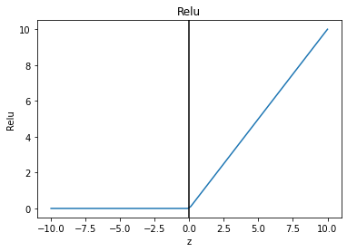

# Appendix: Activation Functions Derivation

##Sigmoid

### Figure 1: Sigmoid

### Eq. 1a: Sigmoid Function 

$$\sigma{x}=\frac{1}{1+e^{-x}}$$

### Eq. 1a: Sigmoid Derivative 

$$\frac{\partial }  {\partial z}\sigma(z)=\frac{\partial }  {\partial z}\frac{1}{1+e^{-z}}=
-\frac{-e^{-z}}{(1+e^{-z})^2}=-\frac{1-(1+e^{-z})}{(1+e^{-z})^2}=-\sigma(z)^2+\sigma(z)=\sigma(z)(1-\sigma(z))$$

## Parabolic Tangent - tanh

### Figure 2: tanh

### Eq. 2a: Hyporbolic Tangent (tanh)

$$
tanh(x)=\frac{e^x-e^{-x}}{e^{x}+e^{-x}}
$$

### Eq. 2a: Hyporbolic Tangent Derivative

## RelU

### Figure 3: RelU

### Eq. 3a: RelU

$$relu(x)=max(0,x)
$$
### Eq. 3b: RelU Derivative
$$\frac{\mathrm{d}}{\mathrm{d} x}relu(x)=\begin{Bmatrix}
0 & if&x <0\\\\\\ 
1 & if& x >0\\\\\\
undefined &if& x==0 
\end{Bmatrix}$$

## Leaky RelU

### Figure 4: Leaky RelU

### Eq. 4a: Leaky Relu

\\(leakyRelu(x)= \text{max ? x : c} \cdot x
\\)
### Eq. 4b: Leaky Relu Derivative
$$\frac{\mathrm{d} }{\mathrm{d} x}[leakyRelu(x)]=\begin{Bmatrix}
c & if &x <0\\\\\\ 
1 & if& x >0\\\\\\
undefined &(unless&c=1)& if&x==0  
\end{Bmatrix}
$$

