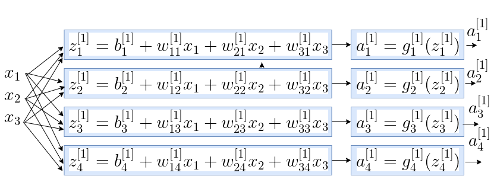
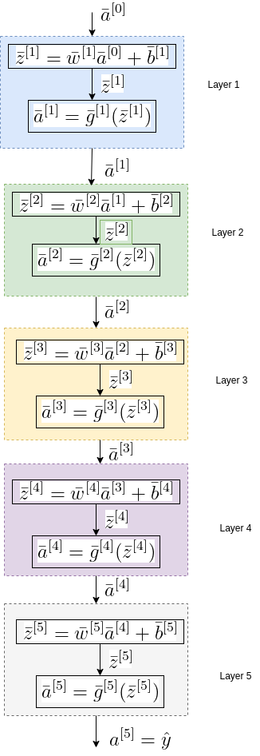

# Forward Propogation

## Introduction

This is the second in series of 3 deep learning intro posts:
1. Introduction to Deep Learning which introduces the Deep Learning technology background, and presents network's building blocks and terms.
2. Forward Propogation, which presents the mathematical equations of the prediction path.

In this post we will examine the forwarding equations of the input data through the network. This is the network's prediction data path, at which the network's weights are static, and only the input data changes. As an oposite to Forward Propogation which calculates the prediction value based on the input data, the Backwards Propogation process calcuates the network's weights. The latter is presented in the next post.

## Network Schemes 

Figure 1 illustrates a Neural Network. The data is forwarded through 15 densely interconnected Neurons. 

The forwarding propogation journey is executed in a layer by layer order, so neurons of layer l calculate their activation output, which is the input data of layer (l+1). 
Throughut this post we will present the forwarding equations based on Figure 1 as an example network.
 
 
 ### Figure 1: Neural Network
 

## Forwarding Propogation with Scalar Equations

Based on the network exapmple of Figure 1, this section presents the forwarding equations of each of the 5 layers, where the input of layer l is the output of layer l-1, for l=2-5. 
Note that the subscripts and superscript conventions are as the following:
- Superscript index in square brackets: Layer index
- Subscript index: Neuron index within the layer
- 2 Subscripts (used for weights indexing): First index is the source Neuron index, and second index is of the destination Neuron.

The goal of this detailed description is to give a detailed forwarding example, with a detailed notations of all the parameters involved and their assigned indices.

So here are the 5 layers equations, listed within the cascaded neurons' sketches:

 ### Layer 1 Forwarding  Equations
 

 ### Layer 2 Forwarding  Equations
 

 
 ### Layer 3 Forwarding  Equations

 ### Layer 4 Forwarding  Equations
 

 ### Layer 5 Forwarding  Equations
 

 
 
 ## Forwarding Propogation with Vector (Matrix) Equations
 
 
The previous section presented the detailed forwaring equations in a scalar form. Goal was to give a detailed example of all the operators and parameters. This section lists the vectorized forwarding equations corresponding to Figure 1, the 5 layers example network. The equations are equivalent to those presented in the previous section, but now in the more computationally efficient and also presentationally compact vectorized form. After specifing the vectorized equations for all 5 layers, the generalized layer forwarding equations are specified.
Note there is no single matrix equation which solves the entire network, but a vectorized seperated equations each layer, as presented next.
Figure 2 presents the vectorized forwarding flow, specifing the vectorized operation at each layer. Following it are the vectorized equation which are a breakdown of the vectorized equations. The input to the first layer, denoted by the vector \\(\bar{x}\\) so far, is now denoted by \\(\bar{a}^{[0]}\\), so that layer 1 notations are similar to all other layers.
 
  
 

### Eq. 1-a: Layer 1 Weighted input

\\(\begin{bmatrix}
z_1^{[1]} \\\\\\ 
z_2^{[1]} \\\\\\ 
z_3^{[1]}  \\\\\\ 
z_4^{[1]}
\end{bmatrix}=
\begin{bmatrix}
w_{11}^{[1]}  & w_{21}^{[1]} & w_{31}^{[1]} \\\\\\ 
w_{12}^{[1]}  & w_{22}^{[1]} & w_{32}^{[1]} \\\\\\ 
w_{13}^{[1]}  & w_{23}^{[1]} & w_{33}^{[1]} \\\\\\ 
w_{14}^{[1]}  & w_{24}^{[1]} & w_{34}^{[1]}
\end{bmatrix} \begin{bmatrix}
a_1^{[0]}  \\\\\\ 
a_2^{[0]} \\\\\\
a_3^{[0]}
\end{bmatrix}+\begin{bmatrix}
b_1^{[1]} \\\\\\ 
b_2^{[1]} \\\\\\ 
b_3^{[1]} \\\\\\ 
b_4^{[1]} 
\end{bmatrix}
\\)

### Eq. 1-b: Layer 1 activation

\\(\begin{bmatrix}
a_1^{[1]} \\\\\\ 
a_2^{[1]} \\\\\\ 
a_3^{[1]} \\\\\\ 
a_4^{[1]}
\end{bmatrix}=\begin{bmatrix}
g_1^{[1]}(z_1^{[1]}) \\\\\\ 
g_2^{[1]}(z_2^{[1]}) \\\\\\ 
g_3^{[1]}(z_3^{[1]}) \\\\\\ 
g_4^{[1]}(z_4^{[1]})
\end{bmatrix}\\)

### Eq. 2-a: Layer 2 Weighted input

\\(\begin{bmatrix}
z_1^{[2]} \\\\\\ 
z_2^{[2]} \\\\\\
z_3^{[2]} \\\\\\ 
z_4^{[2]}
\end{bmatrix}=
\begin{bmatrix}
w_{11}^{[2]}  & w_{21}^{[2]} & w_{31}^{[2]} & w_{41}^{[2]}\\\\\\
w_{12}^{[2]}  & w_{22}^{[2]} & w_{32}^{[2]} & w_{42}^{[2]}\\\\\\ 
w_{13}^{[2]}  & w_{23}^{[2]} & w_{33}^{[2]} & w_{43}^{[2]}\\\\\\ 
w_{14}^{[2]}  & w_{24}^{[2]} & w_{34}^{[2]} & w_{44}^{[2]}
\end{bmatrix} \begin{bmatrix}
a_1^{[1]}  \\\\\\ 
a_2^{[1]} \\\\\\
a_3^{[1]} \\\\\\
a_3^{[1]}
\end{bmatrix}+\begin{bmatrix}
b_1^{[2]} \\\\\\ 
b_2^{[2]} \\\\\\ 
b_3^{[2]} \\\\\\ 
b_4^{[2]} 
\end{bmatrix}\\)

### Eq. 2-b: Layer 2 activation

\\(\begin{bmatrix}
a_1^{[2]} \\\\\\ 
a_2^{[2]} \\\\\\ 
a_3^{[2]} \\\\\\ 
a_4^{[2]}
\end{bmatrix}=\begin{bmatrix}
g_1^{[2]}(z_1^{[2]}) \\\\\\ 
g_2^{[2]}(z_2^{[2]}) \\\\\\ 
g_3^{[2]}(z_3^{[2]}) \\\\\\ 
g_4^{[2]}(z_4^{[2]})
\end{bmatrix}\\)

### Eq. 3-a: Layer 3 Weighted input

\\(\begin{bmatrix}
z_1^{[3]} \\\\\\ 
z_2^{[3]} \\\\\\ 
z_3^{[3]}  \\\\\\ 
z_4^{[3]}
\end{bmatrix}=
\begin{bmatrix}
w_{11}^{[3]}  & w_{21}^{[3]} & w_{31}^{[3]} & w_{41}^{[3]}\\\\\\ 
w_{12}^{[3]}  & w_{22}^{[3]} & w_{32}^{[3]} & w_{42}^{[3]}\\\\\\ 
w_{13}^{[3]}  & w_{23}^{[3]} & w_{33}^{[3]} & w_{43}^{[3]}\\\\\\ 
w_{14}^{[3]}  & w_{24}^{[3]} & w_{34}^{[3]} & w_{44}^{[3]}
\end{bmatrix} \begin{bmatrix}
a_1^{[2]}  \\\\\\ 
a_2^{[2]} \\\\\\
a_3^{[2]} \\\\\\
a_3^{[2]}
\end{bmatrix}+\begin{bmatrix}
b_1^{[3]} \\\\\\ 
b_2^{[3]} \\\\\\ 
b_3^{[3]} \\\\\\ 
b_4^{[3]} 
\end{bmatrix}\\)

### Eq. 3-b: Layer 3 activation

\\(\begin{bmatrix}
a_1^{[3]} \\\\\\ 
a_2^{[3]} \\\\\\ 
a_3^{[3]} \\\\\\ 
a_4^{[3]}
\end{bmatrix}=\begin{bmatrix}
g_1^{[3]}(z_1^{[4]}) \\\\\\ 
g_2^{[3]}(z_2^{[4]}) \\\\\\ 
g_3^{[3]}(z_3^{[4]}) \\\\\\ 
g_4^{[3]}(z_4^{[4]})
\end{bmatrix}\\)

### Eq. 4-a: Layer 4 Weighted input

\\(\begin{bmatrix}
z_1^{[4]} \\\\\\ 
z_2^{[4]}
\end{bmatrix}=
\begin{bmatrix}
w_{11}^{[4]}  & w_{21}^{[1]} & w_{31}^{[1]} & w_{41}^{[1]} \\\\\\ 
w_{12}^{[4]}  & w_{22}^{[1]} & w_{32}^{[1]} & w_{42}^{[1]}
\end{bmatrix} \begin{bmatrix}
a_1^{[3]}  \\\\\\ 
a_2^{[3]} \\\\\\
a_3^{[3]} \\\\\\
a_3^{[3]}
\end{bmatrix}+\begin{bmatrix}
b_1^{[4]} \\\\\\ 
b_2^{[4]}
\end{bmatrix}\\)

### Eq. 4-b: Layer 4 activation

\\(\begin{bmatrix}
a_1^{[4]} \\\\\\ 
a_2^{[4]}
\end{bmatrix}=\begin{bmatrix}
g_1^{[4]}(z_1^{[4]}) \\\\\\ 
g_2^{[4]}(z_2^{[4]}) \\\\\\ 
g_3^{[4]}(z_3^{[4]}) \\\\\\ 
g_4^{[4]}(z_4^{[4]})
\end{bmatrix}\\)

### Eq. 5-a: Layer 5 Weighted input

\\(z_1^{[5]}=
\begin{bmatrix}
w_{11}^{[5]}  & w_{21}^{[5]}
\end{bmatrix} \begin{bmatrix}
a_1^{[4]} \\\\\\
a_2^{[4]}
\end{bmatrix}+b_1^{[5]}\\)

### Eq. 5-b: Layer 5 activation

\\(a_1^{[5]}=
g^{[5]}(z_1^{[5]})\\)

 ## Generalized Forwarding Propogation with Vector (Matrix) Equations
 
 Eq. 6 shows the Feed Forwarding epressions for any layer l, 0<l<L, and a single data exempale vector \\(\bar(x)\\) denoted here by \\(\bar(a)^{[0]}\\) 
 
 ### Eq. 6a: Vectorized Equation for Layer l Weighted input
 $$
 \bar{z}^{[l]}=\bar{w}^{[l]}\bar{a}^{[l-1]}+\bar{b}^{[l]}
 $$
 
 ### Eq. 6b: Vectorized Equation Layer l activation

$$a^{[l]}=
g^{[l]}(z^{[l]})$$

Eq.6 vectors and matrix dimenssions are:
 - \\(\bar{z}^{[l]}\\) : 1 x n(l)
 - \\(\bar{w}^{[l]}\\) : n(l-1) x n(l)
 - \\(\bar{a}^{[l-1]}\\) : 1 x n(l-1)
 - \\(\bar{b}^{[l]}\\) : 1 x n(l)

Where n(l) is the number of neurons in layer l.
 
In a recursive form, we can \\(\bar{z}^{[l]}\\) and \\(a^{[l]}\\) for any layer can be expressed as:
$$
\bar{z}^{[l]}=\bar{w}^{[l]}\bar{a}^{[l-1]}+\bar{b}^{[l]}
$$

 ## Generalized Forwarding Propogation with Vector (Matrix) Equations across multiple examples

Eq. 6a and Eq. 6b are the forwarding equations for a single data input vector. To even more generalized case is the forwarding equation for all training exam or any batch of examples. These multi-examples equations are basically the same as Eq. 6, except the dimensions of the various vector change to a matrix structure as shown in Eq. 7a and Eq. 7b. Accordingly, we the matrix will be denoted in capital letters

### Eq. 7a: Vectorized Equation Layer l Weighted input with m data examples
 $$
 \bar{Z}^{[l]}=\bar{w}^{[l]}\bar{A}^{[l-1]}+\bar{b}^{[l]}
 $$
 
 ### Eq. 7b: Vectorized Equation for Layer l activation with m data examples

$$A^{[l]}=
g^{[l]}(A^{[l]})$$

Where \\(A^{[l]}\\) and  \\(Z^{[l]}\\) are now matrices, each column of which relates to an input data example \\(m\epsilon{M}\\) , like so:

\\(\bar{Z}^{[l]}=\begin{bmatrix}z_1^{[l]{(1)}}& z_1^{[l]{(2)}} & . & . & z_1^{[l]{(m)}}\\\\\\  
 z_2^{[l]{(1)}}& z_2^{[l]{(2)}} & . & . & z_2^{[l]{(m)}}\\\\\\  
 z_3^{[l]{(1)}}& z_3^{[l]{(2)}} & . & . & z_3^{[l]{(m)}}\\\\\\ 
 .& . & . & . &. \\\\\\ 
 . & . &.  & . & . \\\\\\ 
 z_n^{[l]{(1)}}&z_n^{[l]{(2)}}  & . & . & z_n^{[l]{(m)}}\end{bmatrix}\\)

\\(\bar{A}^{[l]}=\begin{bmatrix}a_1^{[l]{(1)}}& a_1^{[l]{(2)}} & . & . & a_1^{[l]{(m)}}\\\\\\  
 a_2^{[l]{(1)}}& a_2^{[l]{(2)}} & . &  .& a_2^{[l]{(m)}}\\\\\\
 a_3^{[l]{(1)}}& a_3^{[l]{(2)}} & . & . & a_3^{[l]{(m)}}\\\\\\ 
 .& . &  .&.  &. \\\\\\
 . & . & . & . & .\\\\\\ 
 a_n^{[l]{(1)}}&a_n^{[l]{(2)}}  & . & . & a_n^{[l]{(m)}}\end{bmatrix}\\)

Eq.7 matrix dimenssions are:

 - \\(\bar{Z}^{[l]}\\) : m x n(l)
 - \\(\bar{w}^{[l]}\\) : n(l-1) x n(l)
 - \\(\bar{A}^{[l-1]}\\) : m x n(l-1)
 - \\(\bar{b}^{[l]}\\) : 1 x n(l)

Where n(l) is the number of neurons in layer l, m is the number of examples, and \\(z_2^{[l]{(m)}}\\) means z of second neuron, lth layer and mth example.

Note that the dimensions of the first term of Eq. 7a is  m x n(l-1), so the 1 x n(l) vector \\(\bar{b}^{[l]}\\) is added to it using broadcasting addition, i.e. \\(\bar{b}^{[l]}\\) is duplicated m times.

### Next steps
 
The next post in this series is about Backwards propogation, which is activated durimg the traing phase, aka fitting, to calculate optimized values for the network's wheights and biases.

