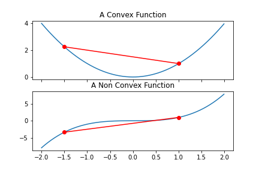
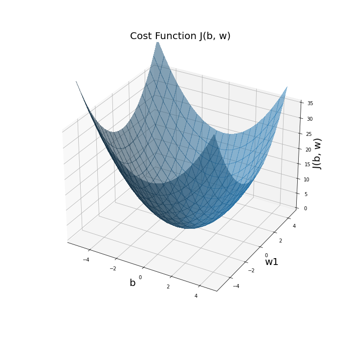
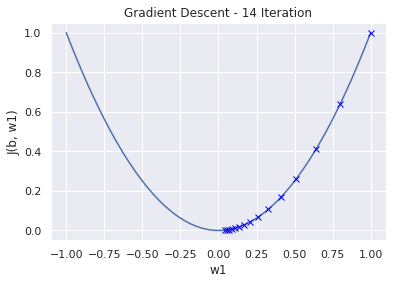
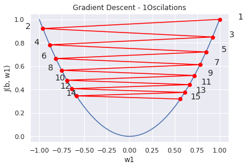

# Linear Prediction Using Gradient Descent

## Introduction

The previous post introduced the Linear Prediction model. It is recommended to read that post first, unless you are familiar with that material. It presented the Analytical Solution for calculating the model's coefficents. The Analytical Solution is fairly simple solution to find coefficients of a Linear Predictor, except it requires an \\(n X n\\) matrix inversion, where n is the dimension of the input data vector. In many cases, that's a non issue, unless the number of features is large, say >1000. Anyway, it's a matter of computational cost and availability.
The current post presents an alternative algorithm, using an optimized iterative solution, named Gradient Descent. Gradient Descent is a simple iterative solution, and commonly used for solving prediction models such as the Logistic Regression predictor, for which the analyitcal solution does not fit. BTW, Logistic Regression will be presented in a next post.

## Outlines of this post

So we need to find the Linear Predictor's set of coefficients \\(b, w_j\\), where j=1:n. (b stands for bias, and w for weight -  see Eq. 1).
Optimization methods need a Cost Function which measure the difference between the true values and the model's prediction results during the Training phase, and an optimization algorithm, which will determine the set of coefficents, aka weights, which minimize the cost.

That's what this post is about: Determining a cost function, and finding the coefficents which minimize it, using the Gradient Descent algorithm.
So let's start!

## Cost Function

The Linear Prediction formula is listed in Eq. 1. Following that,  Eq. 2 presents a Cost functiom, denoted by ***\\(J(w,b)\\)***. The Cost is expressed as the mean squared error between the real and modeled values. The Cost is a sum of that difference over m examples. Alternatively, Eq. 3 presnets another type of Cost function, which is the sume of absolute distances between the real and predicted values. The Cost function expressed in Eq. 2, is commonly used. It has some benefits: It is dependent on squared distances, so error increases faster than the eucleadean distance. In addition, the squared error is convex, which is sigificant for fininding the extreme point (minima or maxima), needed for our calculations.  (What is a convex function? It's a function that the line between 2 points on the graph are alays above the values of the points between those 2 points - see Figure 2.)

Figure 1 depicts graphically the euclidiean distance between the actual value y, and it's corresponding model predicted value \\(d=\hat{y}-y \\) in a 1D domain.

### Eq. 1: Linear Prediction Model

$$
y=\hat{y}+\epsilon=b+\sum_{j=1}^{2}w_j{x}_j+\epsilon
$$

Note that the the superscript i, in Eq 2 and throughout all the equations,  denotes the ith example, where the labeled data sequence, AKA training seqence consists of m examples. Note that the \\(frac{1}{m} \\) factor is just a normalizing factor, but has no significance. 

### Eq. 2: Cost function - Squared Errors

$$J(w,b)=\frac{1}{m}\sum_{i=1}^{m}(\hat{y}^i-y^i)^2$$

Figure 1 depicts graphically the euclidiean distance between the actual value y, and it's corresponding model predicted value \\(d=\hat{y}-y \\).

Note that the \\(frac{1}{m} \\) factor is just a normalizing factor, but has no significance. 

### Figure 1: Approximation Distance

### Eq. 3: Cost function using absolute coordinates differences

$$J(w,b)=\frac{1}{m}\sum_{i=1}^{m}\left | \hat{y}^i-y^i \right |$$

### Figure 2: Convex and Non Convex functions

As stated, the cost function expressed by Eq. 2 is convex, since it is a quadratic equation. Number of variables are n+1. It is possible to illustrate the Cost function graphically, only for the cases where n+1<2. Accordingly, the Cost equation for n=1 is expressed by Eq. 4, and an example plot is shown in Figure 3.

### Eq. 4: Cost function, n=1

$$J(w,b)=\frac{1}{m}\sum_{i=1}^{m}(b^i+w_1x^i-y^i)^2$$

### Figure 3:  Plot illustration of  \\(J(b,w)\\),  n=1:

## Findinding the coefficients - Gradient Descent

Having the Cost function formula in hand, we can continure to our next goal: finding the set of coefficents which minimize it. Obviously, the point at which the Cost function is minimal, is the point where first derivative is 0. 
Gradient Descent algorithm will calculate the coeffcients at that point! Here's the algorithm's formula:

### Eq. 5: Gradient Descent

a: For \\(w_j\\) j=1:n:
$$w_j:=w_j-\alpha \frac{\partial J(b,w) }{\partial w_j}$$

b. For the constant coefficient \((b\\):
$$b:=b-\alpha \frac{\partial J(b,w) }{\partial b}$$

Eq. 5 describes an iterative algorithm, which should run in paralel for all the n+1 variables, i.e. b and  \\(w_j\\) j=1:n.

Before we formulate the algorithm procedure, plugging Eq. 6 into Eq. 2, resultant in Eq.7,  it's easy to get the partial derivatives, as shown in Eq. 8

### Eq. 6
$$
\hat{y}^{(i)}=b+\sum_{j=1}^{n}w_j{x}^{(i)}_j
$$

### Eq. 7
$$
J(w,b)=\frac{1}{m}\sum_{i=1}^{m}(b+\sum_{j=1}^{n}w_j{x}^{(i)}_j-y^{(i)})^2
$$

### Eq. 8a
$$
\frac{\partial J(w,b)}{\partial b}
= \frac{1}{m}\sum_{i=1}^{m}(\hat{y}^{(i)}-y^{(i)}) = \frac{1}{m}\sum_{i=1}^{m}(b+\sum_{j=1}^{n}w_j{x}^{(i)}_j-y^{(i)})
$$

### Eq. 8b
$$\frac{\partial J(w,b)}{\partial w_j} = \frac{1}{m}\sum_{i=1}^{m}(\hat{y}^{(i)}-y^{(i)})*x^{(i)}=\frac{1}{m}\sum_{i=1}^{m}(b+\sum_{j=1}^{n}w_j{x}^{(i)}_j-y^{(i)})*x^{(i)}
$$

## Here's the algorithm's procedure: 
1. Init b,\\(w_j\\) j=1:n to an arbitrary value. (A bad values selection may delay convergance. Check if so by trial and error.)
2. Take  m training labeled examples, \\(x{(^i)},y{(^i)}\\), i=1:m
3. Calculate Cost's gradient using Eq. 8a, 8b.
4. Calculate a new set of n+1 coefficents \\({b, w_1....w_n}\\) using Eq. 5.
5. Check ***termination condition*** (explained next). If not fullfiled, go to step 3.

Figures 4a-4c, depict an illustration of a cost function, projected on one of the coefficent's domain. The crosses markea on the Cost fuction represent the Gradient Descent iterations: the iteration's coeffcients are calculated, and their corresponding Cost value is marked on the graph. Note that as the gradients decrease while striding towards the minima, the distancees between the iterations decrease accordingly, as implied by Eq. 5. At the Cost's minima, where the gradient is 0, the Gradient Descent converges. Figure 4a depict the stride after 1 iteration. Firgure 4b presents 3 more strides, where the decrease of stride size can be easuly seen. Figure 4c presents more strides, till convergence at the minima. 

### Figure 4: Gradient Descent: Gradient of a single parameter

a. After One Iteration

b. After Four Iterations

c. After Fourteen Iterationss

The convergence shown should be achieved simoultansouly on all n+1 dimensions.
Figure 5 depicts Gradient Descent with 2 fimensional variables: b and \\(w_1\\). The graph presents points on the Cost's graph, which relate to the calculated coefficents after each iteration.

### Figure 5: An Illustration of Gradient Descent with n+1=2

### Some notes on the algorithm:
1. Termination condition - when to stop the iterative process.
2. Selection of \\(\alpha\\) - alpha AKA as the learning rate.

### Termination condition: 
There is no definete criteria for termination condtion. Here are 3 common termination criterias:
a. Counting number of iterations - easy to implement, but convergence is not verified.
b. Comparing the the gradient magnitute against a threshold i.e. 

$$\left \| \bigtriangledown J(b,w) \right \| < \epsilon$$

Where:

$$\left \| \bigtriangledown J(b,w) \right \|=
\left \|\frac{\partial J(b,w)}{\partial b},\frac{\partial J(b,w)}{\partial w_1}....\frac{\partial J(b,w)}{\partial w_n} \right \|
$$

c. Check the calculated value and see it is not changing i.e. converged, i.e:

$$\left \| w_j{(i+1))}- w_j{(i))} \right \| < \epsilon
$$

Note that there is no general rule for the 
\\(\epsilon\\), in both options b and c.

### Selection of The Learning Rate (alpha)

The algorithm steps in the opposite direction of the gradient until convergence, as the gradient, multiplied by a constant \\(\alpha\\), AKA :earning Rate, is decremented from previous value.

One might assume that the larger \\(/alpha\\) is, the fastest convergence will be. Wrong assumption! A too large step-size may result with oscilations. Look at Figure 9.

### Figure 9: Gradient Descent Oscilation

Conclusion - step size should be carefully selected, and may be needed to tune during caluclations. Typical values are in the range of 0.001-1, which is quite a wide range. Normally you will make some iterations before selecting your learning rate.

