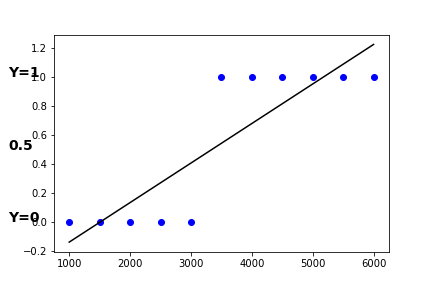
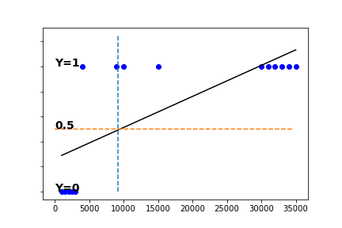

# Logistic Regression

Logistic regression is an algorithm for performing Ninary Classification. This post introduces the algorithm outlines, with an illustration of a simplified classifcation problem. 

assign observations to a discrete set of classes. Some of the examples of classification problems are Email spam or not spam, Online transactions Fraud or not Fraud, Tumor Malignant or Benign. Logistic regression transforms its output using the logistic sigmoid function to return a probability value.

Binary Classification as its name implies, classifies input data to one of 2 hypothesis. Naturally, the 2 binary hypotheses are assigned with a binary indices,  either 0 or 1. So decisions such as whether a tumor is malignant or not, will a customer purchase an item or not, require a Binary Classification. In the context of machine learning. Binary Classification belongs to the Supervised Machine Learning category. Just to note, previous posts where about Regression Supervised Learning,which also belongs to the same  machine learning category, but fits prediction of continous values, such as price, anounts, periods, etc, while the Binary Classifier decides between 2 descrete decisions. BTW, one of the next posts will present the extension of Binary Classification to Multi-Class Classification.
y differ 
The Supervise Learning Outlines diagram (Figure 1) is similar to the one presented presented in the context of Regression Machine Learning. They differ only in  the prediction model,  and subsequently in the nature of the output.
In this We'll present the Logistic Regression prediction model, which fits Binary Classification. We'll start by showing that a continous prediction models such as the Linear Prediction model don't fit. After that, we will show how to calculate the predictor's coefficients with the Gradient Descent algorithm.

#### Figure 1: Supervise Learning Outlines

So let's start! 

## An introduction to the Logistic Regression

To illustrate Binary Classification let's take a simple example: It is required to predict the if a customer will buy a product, based on her income. (A good prediction indeed can't base on inome only. Still, the simplified example eases the graphical illustration. Anyway, the model and solution will support mult-deatured input data)

To set the predictor, we first need to have a training data sequence, with labeled customers' income data. Figure 2 presents such data, collected from 11 customers. Each data point is labeled by either Y=1, if the  customer did purchase, or Y=0, if he did not purchase. (The assignment of 0 or 1 to the hypothesises is arbitrary, though it makes more sense to assign a 1 to the positive hypothesis.

#### Figure 2: Labled Data: customers' income, labeld by Y=1/0 if customer did buy/did not buy

Now it is needed to train a predictor with this data. But which model should we train? Will the Linear Prediction model, which we already deployed for Regression Prediction fit? Let's examine that!. Figure 3 illustrates a linear line which fits the data point. Will it fit? 

#### Figure 3: Linear Prediction Mode: Will it fit binary classifcation?

If we set the decision boundary to 0.5, it seems to give correct results. Take a look at Figure 4:  An income of 3000 maps to 0.4, i.e. Y=0. An income of 3500 maps to 0.5 i.e. Y=1.  Linear prediction seems like a good predictor if threshold is set to 0.5. Is that a correct conclusion? ****it's not correct!**** Figure 5 proves that.

#### Figure 4: Linear Prediction for Binary Classification with thresholds

Adding more data points, as presented by Figure 5, changes the line predictor's results: Now the predictor maps a customer with an income of 5000 to a point on the line which is below the 0.5 threshold. Obviously, the linear prediction won't work for Binary Classification. Another different prediction model is needed. Let me introduce the Logistic Regression Model..

#### Figure 6: Linear Prediction for Binary Classification with thresholds - Problem!

## Logistic Regression Model

The Logistic Regression is a model which predicts the ****probability**** of the hypothesises. The model is based on the sigmoid function, which is presented in Eq. 1 and sketched in Figure 6.

#### Eq. 1: Sigmoid Function

$$\sigma(z)=\frac{1}{1+e^{-z}}$$

#### Figure 6: Sigmoid Function

#### Sigmoid Properties:

##### $$\sigma(z)_{z \to  -{\infty}} \to 0$$

##### $$\sigma(z)_{z \to  {\infty}} \to 1$$

##### $$\sigma(z)_{z=0}=0.5$$

For Logistic Regression predictor, z argument is replaced by a linear combination of the input dataset x, as shown by Eq. 2:

#### Eq. 2: 
$$z=b+wx$$, 

Plugging  Eq. 2 into Eq 1, results in the Logistic Regression  expression, which is the probability of y=1, given the input vector x and the coefficent set {w,b}.

#### Eq. 3: Logistic Regression Formula

$$p(y=1| x,w,b) = \sigma(b+w^Tx) = \frac{1}{1+e^{^{-(b+w^Tx)}}}$$

Obviously the dependent probability of y=0 is:

#### Eq. 5: Probability of y=0 Regression Formula

$$p(y=0| x,w,b) = 1-p(y=1| x,w,b) = 1- \frac{1}{1+e^{^{-(b+w^Tx)}}}$$

Examining the probailities at the limits and in the middle, we can note that:

$$p(y=1|b+w^Tx \to -{\infty}) \to 0$$

$$p(y=1|b+w^Tx \to {\infty}) \to 1$$

$$p(y=1|b+w^Tx =0 ) = 0.5$$

$$p(y=0|b+w^Tx \to -{\infty}) \to 0$$

$$p(y=0|b+w^Tx \to {\infty}) \to 1$$

$$p(y=0|b+w^Tx =0 ) = 0.5$$

 
 
Next paragraphs we will show how to calculate the Logistic Regression coefficients.

## Finding Logistic Regression Coefficents

In previous posts on Linear Predictor, 2 solutions for for finding the predictor's coefficents were presented:
1. The analytical solution
2. Gradient descent, based on minimizing the Cost function.

Since the predictor's equation is not linear, as it is for the Linear predictor, (reminder: \\(Y=XW+\epsilon\\)), but instead, the predictor's equation is non-linear, where X and W are exponential coefficents, there is no simple analitical solution.
Gradient Descent over a Cost function does work, as we will show soon. Remember that in order to guaranty convergence in a non-local minima, the cost function should be convex. (Remeber what convex is? find explaination here + figure 7 illustrate the idea)

#### Figure 7: CONVEX AND NON CONVEX FUNCTIONS

A function is convex if the line between 2 points on the graph are alays above the values of the points between those 2 points

#### Logistic Regression Cost Function

Recalling the cost function used for Linear Refression, the selection of the square error expression as the Cost function might have seemed to be the best and straight forward choice. The square error expression for Logistic Regression is shown in Eq. 6. It is not a convex function, so we are prevented from taking the Square Error expression as our cost function.

#### Eq. 6: square error expression for Logistic Regression

$$SE = \frac{1}{m}\sum_{i=1}^{m}\frac{1}{2}(\hat{y}^i-y^i)^2=\frac{1}{m}\sum_{i=1}^{m}\frac{1}{2}(\frac{1}{1+e^{^{-(b+w^Tx^i)}}}-y^i)^2$$

Instead, the Loss function used is presented in Eq. 7. The detailed development of this expression is presented in the appendix. Note that ***Loss*** function is calculated for a single instance of training data, while Cost is an average of m Loss entries. The superscript i of the loss entries, indicates the index in the traing data sequence. The `log` operator is in natural logarithm. 

Eq. 7a assigns expressions for y=0 and y=1. Eq. 7b combines both equations. Figure 8 illustrate a Loss function, presenting both y=0 and y=1 parts. The behavior of the Loss function is self explained, so I'll not add more on that. The overall Cost function is the sum the m training examples Loss functions, as shown in Eq. 8.  

#### Eq. 7ba: Loss function used for Logistic Regression
$$\begin{cases}
L(b,w)= -log(\hat{y}^i) & \text{ if } y^i=1\\\\\\
L(b,w)= -log(1-\hat{y}^i) & \text{ if } y^i=0
\end{cases}$$

Or expressing it in a single equation:

##### 7b: Loss express in  expressing it in a single equation:

$$L(b,w)=-log(\hat{y}^{(i)})*y^{(i)}$$

$$-log(1-\hat{y}^{(i)})*(1-y^{(i)})$$

Figure 8: Logistic Regression Lost Function

From Eq. 8, we need find the the n+1 coefficients, b and w, whch minimize the cost. Fortunatley, as explained in the Mathematical development section, the Cost function, is concave. This is an important property, otherwise, with local minima poits, it would be harder to find the global minima. But unfortunatley, unlike the Linear Predictor's Cost function, it is not possible to find am analytical solution. Let's have some insight on that:

We need to take the first derivative of the cost function, \\(\frac{\partial }{\partial w_i}J(b,w)\\),  set it to 0 and solve. The derivative formula of Eq. 8 is derived just a few lines ahead, and the result is:

$$\frac{\partial }{\partial w_i}J(b,w)=\frac{1}{m}\sum_{i=1}^{m}(\sigma(b+w^Tx^{(i)}) -y^{(i)})x_i^{(i)}$$

Plugging in:

$$\sigma(b+w^Tx^{(i)}) =  \frac{1}{1+e^{b+wTx^{(i)}}}$$

We get:

$$\frac{\partial }{\partial w_i}J(b,w)=\frac{1}{m}\sum_{i=1}^{m} (\frac{1}{1+e^{b+wTx^{(i)}}} -y^{(i)})x^{(i)}$$

We have a sum of m none linear functions, for which there is no analytical solution, with the exception of special cases with 2 observations, as explained in the paper by Stan Lipovetsky https://www.tandfonline.com/doi/abs/10.1080/02664763.2014.932760.

Instead, we can use a mone alanlytical solution, such as the ****Gradient Descent****. 

Gradient Descent was already explained to the details, and illustrated with the Linear Predictor. So here we can jump directly to implement the solution for Logistic Regression..

Here's the  Gradient Descent operator set on cost function J(b,w), for the free coeffcient {b} and the other linear coefficients {w_j}

#### Eq. 9:  Gradient Descent

#### Eq. 9 a:
$$b:=b-\alpha \frac{\partial J(b,w)}{\partial b}$$

#### Eq. 9b:
$$w_j:=w_j-\alpha \frac{\partial J(b,w)}{\partial w_j}$$
For all {b}, {w_j} j=1...n calculate:

Eq. 9a and 9b for all n coefficents should be repeated iteratively repeated until all {b} and all \\({w_j}\\) converge. The convergence point, is the point where all derivatives are 0, i.e. the minima point. 

The development of the partial derivative \\(\frac{\partial L(b,w)}{\partial w_i}\\), is detailed in the appendix below. The result is presented in Eq 10.

#### Eq 10 a: Cost Function Partial Derivative
$$\frac{\partial }{\partial w_i}J(b,w)=\frac{1}{m}\sum_{i=1}^{m}(\hat{y}^{(i)} -y^{(i)})x^{(i)}$$

Pluging $$\hat{y}^{(i)}=\sigma(b+w^Tx^{(i)})$$ into Eq. 10a gives:

#### Eq 10 b: Cost Function Partial Derivative:
$$\frac{\partial }{\partial w_i}J(b,w)=\frac{1}{m}\sum_{i=1}^{m}(\sigma(b+w^Tx^{(i)}) -y^{(i)})x_i^{(i)}$$

Now we are ready to the itterative calculation of \\(w_i, i=1-n\\) and \\(b\\) with Gradient Descent.

Here's the Gradient algorithm procedure:

1. Initialize all n+1 unknow coefficients with an initial value.
2. repeat untill converged: 
   \\ $$b = b - \alpha \frac{1}{m}\sum_{i=1}^{m}(\sigma(b+w^Tx^{(i)}) -y^{(i)})$$
   and for i=1 to n:
   $$w_i = w_i-\alpha \frac{1}{m}\sum_{i=1}^{m}(\sigma(b+w^Tx^{(i)}) -y^{(i)})x_i^{(i)}$$
  

