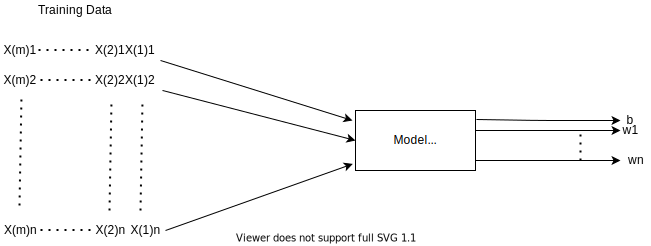
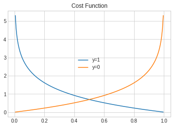

# Logistic Regression

## Preface

This post introduces Logistic regression, an algorithm for performing Binary Classification. 
This introduction to Logistic Regression contains 4 chapters:

1. Background: Supervised Learning and Binary Classification
2. Classification Model Selection - why not Linear Regression?
3. Presentetion of Logistic Regression Model
4. Logistic Regression Cost Function
5. Gradient Descent Solution

##  Background: Binary Classification, Supervised Learning

Binary Classification, is the operation of assigning the observations into one of two classes, auch as: 'a tumor is malignant'/'a tumor is not malignant',  or 'a  customer purchase an item'/'a customer does not purchase an item', The picture is of a cat/dog, etc. 
The classes will be represented by numeric values, normaly 0 and 1, when the convention is to assign the 1 to the poisitive class and the 0 to the negative, e.g. 'yes' is 1 and 'no' 0.

Binary Classification belongs to the Supervised Machine Learning category, which model is presented by Figure 1. The Supervised machine learning system runs through 3 phases as depicted in Figure 1, a-c. Figure 1 presents a system with n-dimensional input (AKA n features), denoted by\\(x_1-x_n\\), and the predictor's corresponding n+1 coefficients, denoted by \\(b\\) - the bias coefficient, and \\(w_1-w_n\\).

***Training Phase*** - during the Training phase, the predictor's coefficients are calculated, as depicted by Figure 1-a. The Training data consists of m examples, denoted by superscripts 1-m. The optimizer calculates the predictor's coeffcients, by minimizing a cost function, which expresses the error between the expected value \\(y\\) and the predcited/modeled value \\(\hat(y)\\). 
***Validation Phase*** - during the Validation phase, the predictor's performance is validated, using a cost function as depicted in Figure 1-b. In case results are not acceptable, the Training phase should be revisited. The input dataset consists of k sets om labeled input data.
***Normal Data Phase*** - During the Data phase, the system predicts the output for the input data.

In the case of Binary Classification, the epected result is binary: 0 or 1. We will show next the consideration for chosing the predictor (which eventually will be Logistic Regression). After that, we will develop the equations for calculating the predictor's coefficients, using Gradient Descent.

### Figure 1: Supervise Learning Model

### Figure 1-a: Training Phase.  
****The Training input Dataset consists of m labeled examples, each of n features.****
The Optimizer finds the set of coefficients which minimize the cost function.

### Figure 1-b: Validation Phase
****The Validation input Dataset consists of k labeled examples, each of n features.****
The predictions are validated by checking the cost function.

### Figure 1-c: Normal Data Phase
****The Normal Data input Dataset consists n features.****

## Fitting a Classifier Model - Trying Linear Regression To Fit Binary Classification

Here's a simplified example which illustrates Binary Classification: It is required to predict if a customer will buy a product, based on his/her income. (Note: A good prediction indeed can't base on inome only, and anyway needs much more data points. Still, the simplified example eases the illustration.)

To train the predictor, we use a training data sequence, which consists of labeled data from 11 observations, as presneted by table 1: 

### Table 1:  Purchase Training Data

|`Income  | Did customer buy? |
|:--------|:------------------|
| 1000    |yes                |
| 1500    |yes                |
| 2000    |yes                |
| 2500    |yes                |
| 3000    |yes                |
| 3500    |yes                |
| 4000    |no                 |
| 4500    |no                 |
| 5000    |no                 |
| 5500    |no                 |
| 6000    |no                 |

Table 1's data is presented on a graph - see Figure 2, where Y=1 means "Customer did purchase". Based on these poinst, it isa needed to perform a predictor which  should be able to make the purchace prediction based on customers' income. We begin by tryin to fit in a Linear Predictor. Will it work?
Figure 3 presents a linear line which was produced by the Linear Regression algorithm. Does it indeed fit? If we set the decision boundery at y=0.5, as illustrated in Figure 3, it seems as if it fits: All the points with income less than 3500 map to 0, and all the rest to 1. But that is an illusion. The Linear Predictor can't realy fit here. Let's show that by taking more observations, as illustrated by Figure 4. Now the line, produced by Linear Regression, maps data points with with an imcome below ~9000 to 0. If we took more points, the classification results might change more, anyway, they can't fit the training data points. Next candicate: Logistic Regression Algorithm!

ense to assign a 1 to the positive hypothesis.

### Figure 2: Labled Data: customers' income, labeld by Y=1/0 if customer did buy/did not buy

### Figure 3: Linear Prediction for Binary Classification with thresholds

### Figure 4: Linear Prediction for Binary Classification with thresholds - Problem!

## Logistic Regression Prediction Model

The Logistic Regression is a model which predicts the ****probability**** of the hypothesises, .e. given the observation x, it predicts the decision \\(\hat{y}\\), 
where is a \\(\hat{y}=p(y=1|x)\\), is the probability of the decision to be 1, given the input x. 

The model used for the prediction of the conditional probability, is sigmoid function, which is presented in Eq. 1 and sketched in Figure 5a.

### Eq. 1: Sigmoid Function

$$\hat{y}(z) = \sigma(z)=\frac{1}{1+e^{-z}}$$

### Figure 5a: Sigmoid Function

#### Sigmoid Properties:

##### $$\sigma(z)_{z \to  -{\infty}} \to 0$$

##### $$\sigma(z)_{z \to  {\infty}} \to 1$$

##### $$\sigma(z)_{z=0}=0.5$$

For Logistic Regression predictor, z argument is replaced by a linear combination of the input dataset x, as depicted by Eq. 2:

### Eq. 2: z argument expression
$$z=b+wx$$, 

Where b stands for bias, and w for weight.

Plugging  Eq. 2 into Eq 1, results in the Logistic Regression  expression, which is the probability of y=1, given the input vector x and the coefficent set {w,b}.

### Eq. 3: Logistic Regression Formula

$$p(y=1| x,w,b) = \sigma(b+w^Tx) = \frac{1}{1+e^{^{-(b+w^Tx)}}}$$

Obviously, the dependent probability of y=0 is the the mirror picture of the above, as presented by Eq. 4 and Figure 6a

### Figure 5b: Reverse Sigmoid Function, Probability for y=0

### Eq. 4: Reverse Sigmoid - Probability of y=0 Regression Formula

$$p(y=0| x,w,b) = 1-p(y=1| x,w,b) = 1- \frac{1}{1+e^{^{-(b+w^Tx)}}}$$

Examining the probailities at the limits and in the middle, we can note that:

$$p(y=1|(b+w^Tx) \to -{\infty}) \to 0$$

$$p(y=1|(b+w^Tx) \to {\infty}) \to 1$$

$$p(y=1|(b+w^Tx) =0 ) = 0.5$$

$$p(y=0|(b+w^Tx) \to -{\infty}) \to 1$$

$$p(y=0|(b+w^Tx) \to {\infty}) \to 0$$

$$p(y=0|(b+w^Tx) =0 ) = 0.5$$

This section presented the Logistic Regression formula (Eq. 3). Our goal is to find the predictor's coefficients {b, w}, which optimize the prediction. Optimization means - minimization of a cost function. Next section presents the Logistic Regression Cost function.

## Logistic Regression Presentation

Before developing the cost function, and following with finding the optimizing sigmoid coefficients, let's redraw the ML model's diagrams, (Figure 1), plugging in the Logistic Regression model:

### Figure 6: Supervise Learning Model

### Figure 6-a: Training Phase.  
****The Training input Dataset consists of m labeled examples, each of n features.****
The Optimizer finds the set of coefficients which minimize the cost function.

### Figure 6-b: Validation Phase
****The Validation input Dataset consists of k labeled examples, each of n features.****
The predictions are validated by checking the cost function.

### Figure 6-c: Normal Data Phase
****The Normal Data input Dataset consists n features.****

## Logistic Regression Cost Function

In the itroductive posts on Linear Predictor, 2 methods were presented for finding the predictor's coefficents:
1. The analytical solution, which can be implemented when the set of equation is linear.
2. Gradient descent, which is an optimization iterative method, based on minimizing a Cost function.

Since the predictor's equation (Eq. 3) is not linear, it is impossible to implement the analytical solution. Instead, we need to implement an optimization method.
Optimization methods need a Cost Function which measure the difference between the true values and the model's prediction results during the Training phase, and an optimization algorithm, which will determine the set of coefficents, aka weights, which minimize the cost. 
We will now define a cost function accordingly, and after that, find the coefficents which minimize the cost using the Gradient Descent algorithm.

Speaking of a Cost Function, the most intuitive, straight-forward formula to be assigned as a cost function is the Mean Squared Error, like done for Linear Regression. 
The square error expression for Logistic Regression is presented in Eq. 5. Problem is - it is not a convex function. That makes it non suitable for a cost function, as our next step is to find the Cost function's global minimum.

### Eq. 5: square error expression for Logistic Regression

$$SE = \frac{1}{m}\sum_{i=1}^{m}\frac{1}{2}(\hat{y}^i-y^i)^2=\frac{1}{m}\sum_{i=1}^{m}\frac{1}{2}(\frac{1}{1+e^{^{-(b+w^Tx^i)}}}-y^i)^2$$

BTW, let's recall what does the 'convex function' term means: in order to guaranty that a function's minima is a non-local minima, the cost function should be convex. A function is convex if the line between 2 points on the graph are alays above the values of the points between those 2 points. Figure 7 illustrates a convex and a non-convex functions.

### Figure 7: CONVEX AND NON CONVEX FUNCTIONS

Back to our cost function -  Eq. 6 and Eq. 7 present the Logistic Regression Loss function.  Note that while the ***Loss*** function is calculated for a single instance of training data, the Cost function, we aim for, is an average of m Loss entries. The superscript i of the loss entries, is the index in the traing data sequence. The `log` operator is a natural logarithm. 

[The detailed development of the cost expression is presented here.](logistic-regression-cost-function.md)

Eq. 6 assigns expressions for y=0 and y=1. Eq. 7 combines both equations. Figure 8 illustrate a Loss function, presenting both y=0 and y=1 parts. The behavior of the Loss function is self explained, so I'll not add more on that. The overall Cost function is the sum the m training examples Loss functions, as depicted in Eq. 8.  

### Eq. 6: Loss function used for Logistic Regression
$$\begin{cases}
L(b,w)= -log(\hat{y}^i) & \text{ if } y^i=1\\\\\\
L(b,w)= -log(1-\hat{y}^i) & \text{ if } y^i=0
\end{cases}$$

Or expressing it in a single equation:

### Eq. 7: Loss express in  expressing it in a single equation:

$$L(b,w)=-log(\hat{y}^{(i)})y^{(i)}-log(1-\hat{y}^{(i)})(1-y^{(i)})$$

Figure 8: Logistic Regression Loss Function

With the Cost function at hand, we need to find the the n+1 predictor's coefficients, b and w, which minimize the Cost function. Fortunatley, as explained in the Mathematical development section, the Cost function, is concave. This is an important property, otherwise, a detected minima point may be just a local minima, but not a global minima, which makes it harder to find the global minima. 
So far so good, though unfortunatley, it wouldn't be possible to find an analytical solution for the parameters, as we did the Linear Predictor's Cost function 
Let's show that:

To find the minima, We take the Cost function's first derivative: \\(\frac{\partial }{\partial w_i}J(b,w)\\),  set it to 0 and solve for the coefficients. The derivative of the Cost function is: [The detailed development of the cost expression derivation is presented here.](logistic-regression-cost-function-derivative.md)

$$\frac{\partial }{\partial w_i}J(b,w)=\frac{1}{m}\sum_{i=1}^{m}(\sigma(b+w^Tx^{(i)}) -y^{(i)})x_i^{(i)}$$

Plugging in:

$$\sigma(b+w^Tx^{(i)}) =  \frac{1}{1+e^{b+wTx^{(i)}}}$$

We get:

$$\frac{\partial }{\partial w_i}J(b,w)=\frac{1}{m}\sum_{i=1}^{m} (\frac{1}{1+e^{b+wTx^{(i)}}} -y^{(i)})x^{(i)}$$

We have a sum of m none linear functions, for which there is no analytical solution, with the exception of special cases with 2 observations, as explained in the paper by Stan Lipovetsky https://www.tandfonline.com/doi/abs/10.1080/02664763.2014.932760.

Instead, we can use a mone alanlytical solution, such as the ****Gradient Descent****. 

## Finding the Coefficients with Gradient Descent

Gradient Descent was already explained in details, and illustrated with the Linear Predictor. So here we can jump directly to implement the solution for Logistic Regression..
Eq. 9 presents the recursive equation for finding the coeffcients. (We seperate Eq. 9a which calculates the free coefficents from the other coefficients, but clearly 9a and 9b are identical).

Eq. 9a and 9b for all n coefficents should be repeated iteratively until {b} and all \\({w_j}\\) converge. The convergence point, is the point where all derivatives are 0, i.e. the minima point. 

The development of the partial derivative \\(\frac{\partial L(b,w)}{\partial w_i}\\), is detailed here] (logistic-regression-cost-function-derivative). The result is presented in Eq 10.
The considerations for the selection of the the step size \\(\alpha\\) AKA learning rate, with a detailed explaination on the algorithm can be found it in Linear Regression post.

Till Here!!!!

### Eq. 9:  Gradient Descent

### Eq. 9 a:
$$b:=b-\alpha \frac{\partial J(b,w)}{\partial b}$$

### Eq. 9b:
$$w_j:=w_j-\alpha \frac{\partial J(b,w)}{\partial w_j}$$
For all {b}, {w_j} j=1...n calculate:

### Eq 10 a: Cost Function Partial Derivative
$$\frac{\partial }{\partial w_i}J(b,w)=\frac{1}{m}\sum_{i=1}^{m}(\hat{y}^{(i)} -y^{(i)})x^{(i)}$$

Pluging $$\hat{y}^{(i)}=\sigma(b+w^Tx^{(i)})$$ into Eq. 10a gives:

### Eq 10 b: Cost Function Partial Derivative:
$$\frac{\partial }{\partial w_i}J(b,w)=\frac{1}{m}\sum_{i=1}^{m}(\sigma(b+w^Tx^{(i)}) -y^{(i)})x_i^{(i)}$$

Now we are ready to the itterative calculation of \\(w_i, i=1-n\\) and \\(b\\) with Gradient Descent.

Here's the Gradient algorithm procedure:

1. Initialize all n+1 unknow coefficients with an initial value.
2. repeat untill converged: 
   \\ $$b = b - \alpha \frac{1}{m}\sum_{i=1}^{m}(\sigma(b+w^Tx^{(i)}) -y^{(i)})$$
   and for i=1 to n:
   $$w_i = w_i-\alpha \frac{1}{m}\sum_{i=1}^{m}(\sigma(b+w^Tx^{(i)}) -y^{(i)})x_i^{(i)}$$
  

