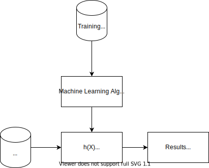

# Binary Classification and Logistic Regression

This post is about Supervised Classification problems, at which it is needed to predict a descret value, e.g. predict if a customer will buy the product or not, or predict whether a tumor is benign or malignant. 
We denote the value y of the binary classes as 0 and 1, so we asign the value y=0 to denote the 'customer does not purchase', or the 'tumor is benign; hypothesis , and accordingly, y=1 to denote 'customer does purchase' or 'tumor is malignant' hypothesis.

So let's follow our example of predicting customers' purchases based on their income. (This is a simplified for the sake of the example, even if technically the income feature is clearly not sufficient to predict a purchase).

Figure 2:  Binary Classification - Purchace as a function of income

Can linear Prediction model this data? Look at Figure 3.

Figure 3: Linear Prediction for Binary Classification

Looking at Figure 3, one might tend to think that linear prediction might work for binary classification also. Look at figure 4: the threshold is at 0.5, and anything to its right is indeed 1. 

Figure 4: Linear Prediction for Binary Classification with thresholds

But the above graphical presentaions may be missleading. If we had more points, as presented by Figure 5, then we could realize that now the line predicts values < 0.5 for points which value 1s 1.

Figure 5: Linear Prediction for Binary Classification with thresholds - Problem!

Obviously, the classification is not a linear function, another different prediction model is needed - The Logistic Regression Model.

## Logistic Regression Model

The Logistic Regression is currently the most common predictor model used for binary classification. The model is based on the sigmoid function presented in Eq. 1. 

Eq. 1: Sigmoid Function

$$g(z)=\frac{1}{1+e^{^{-z}}}$$

The sigmoid function's values are in the range [0,1], as shown in Figure 5

Figure 5: Sigmoid Function

The Logistic Regression predictor is based on Eq. 1, substiuted z by $$b+wx$$, swhere $$x$$ is the system's input AKA features, and {b,w} are the predictor's coefficients.

Eq. 2: Logistic Regression Formula

$$h(b+w^Tx)=\frac{1}{1+e^{^{-(b+w^Tx)}}}$$

Let's clarify an important aspect of the estimated value: Unlike the Supervised Regression prediction, the interpretation of $$h(b+w^Tx)$$ is not an estimation of $$y$$, denoted by $$/hat(y)$$ as before, but the probability of the y=1 hypothesis, which can be represented by $$p(y=1|x,b,w). The probability is > 0.5 for z>0,  and naturally < 0.5 for z < 0. So, for input value x, if p(y=1|x,b,w) = h(|x,b,w) > 0.5, the classiication decision that should be taken is 1, with a probability p(y=1|x,b,w). This probability tends ro 1, as z >> 0, and tends to 0, as z << 0.

Logostic Regression is currently one of the most commom prediction model algorithm used by Machine Learning algorithms for binary classification. In case you're not familiar with prediction models, and how to solve for their coefficients, or even in case you have no clue about what prediction am I talking, I suggest you read my post on that before. Not mandatory though. If the term "Binary Classification" needs clarifications, I'd start with my Intro to Machine Learning. Not mandatory though.

In any case, to start with, I posted here again the Supervised Machine Learning blog diagram.

#### Figure 1: Supervised Machine Learning blog diagram

As Figure 1 shows, the predictor sits in the heart of the system. The perdictor's coeficients are calculated during the Training phase, then ready to use in the Testing and Normal Data phases.

This post explains the Logistic Regression model, and the developemnt of the model's parameters' solution. We'll walk top to bottom - begin with an illustration of a classification problem, then present the Logistic Regression predictor model, and eventually show how to find its coefficients, with the good-old Descent Regression algorithm.

Here's the (commonly used) binary classification example: It is needed to predict whether a tumor is benign or maligent, based on its size. 

multi class

we need to predict if a customer will buy Iphone as his next phone, based on the next smartphone of a customer , which already owns a smatphone,  will buy another iphone after 2 years, based on whether he owned an iphone before or not. We'll see that normally a 
. This example is not realy realistic, but we'll use it to start with binary prediction based on a single feature. So, suppose we need to predict if a customer, which already owns a smatphone,  will buy an iphoe, based on whether he owned an iphone before or not. Suppose  that if he owned one 

