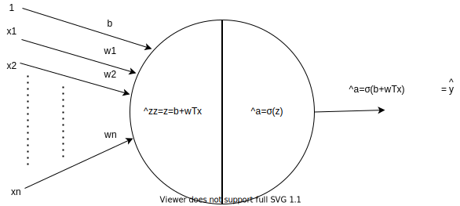

## Deep Learning

This post introduces Deep Learning, which a branch of Machine Learning. Bassically both use the same building blocks, but Deep Learning, (DL), a denser architecture which achieves better performance for complicated problems. Let's show that.

Figure 1 depicts the the scheme of Logistic Regression prediction model. Observing the scheme from its left side, the input data set consists of n elements \\(x_1-x_n\\), multiplied by n weights \\(w_1-w_n\\). The weighted inputs are sumed, together with the bias input b. Then this sum is activated by a sigmoid, which is a non linear function, used for binary decision. The sigmoid output, a, is here the predicted decision value , \\(\hat{y}\)). The weights and bias values are determined in the Training phase. 

### Figure 1: Logistic Regression Data Network

Figure 1 may resemble a Nueron, where the data input lines resemble the dendrites, by which the neuron receives input from other cells.
With the Neuron in mind, it will be easy to prescieve the neural network structure in Figure 2.

### Figure 2: Neural Network

Following Figure 2, here below are some commonly used terms:

- **Layers**: The Neural Network is arranged in layers. The network presented in Figure 2 has 5 layers - marked L1-L5. Each layer consists of 4,4,4,2 and 1 neurons respectively.
- **Desnse Layers**: Fully connected layers. The Deep learning scheme is based on densely connected neural networks.
- **Input Layer**: A layer with input exposed to outside of the network. It is conventionally not counted in the layers count.
- **Hidden Layer**: Layers which both input and output are  connected to other network's layers - L1-L4 are Hidden layers.
- **Output Layer**: A layer with output exposed to outside of the network -  L5 in Figure 2.
- **Deep Neural Network**: A neural network with many layers. There is no definite minimal number of layers for that, though 3 hidden layers used to be regarded "Deep".

Figure 3 depicts a Nueral Network with less layers and neurons, which might be more comfortable to illustrate its structure in more details. Some notes on the notations:
- **Superscript index in square bracketed**: Example: \\x^{[i]}\\). The index i indicates the layer index the value of x relates to
- **Subscript index**: Example: \\x^i\\) or \\x^{ij}\\). The first index indicates the current layer's index, while the second index, if exists, indicates the destination layer. 
- **weights**: In the deep learning model, the weights multiply the layer's data input, before being summed up with all other weighted inputs which are connected to the same neuron. Example: \\(w_{21}^[2]\\) in Figure 3, is the weight which corresponds to the input coming from the seconds neoron of Layer 1, to the second neoron of layer 2.

- **bias**: Bias multiplies a constant 1 and summed up with all weighted inputs. Example: \\(b_2^{[1]}\\) is the bias added to the second element of Layer 1.

### Figure 3: Neural Network - A More Detailed Scheme

One may wonder if this should be considered a Deep Nueral Network or a Shalow Network. There is no definite answer dor that, but 

Figure 1 presents a 4 layer neural networks:
- The input layer is of size 3
- Layers 1 and 2 (marked by L1 and L2), have 4 neurons each, 
- layer 3 has 2 neurons
- layer 1, the output layer has a single neuron. 

Here's a focus on the first element of L1:

A leyer is a group of Neurons, not connected to each other  
The network presented in Figure 2 has 4 layers, as marked on the diagram. The input layer is not counted as a layer - this is the common convention. The 3 inner network (L1-L3) are called Hidden Layers, since their inputs and outputs are internal.

a meshed networklayered meshed  of 

like logistic regression, repeated a lot of times

Previous posts presented Machine Learning, and its computation element - it is depicted in Figure 1.

If there are many layers without an activation function, it is always computing a linear prediction function, no matters how layers the network has.

The case with no activation function is the linear regression - predict a price etc.

and Deep learning is an approach to machine learning characterized by deep stacks of computations. This depth of computation is what has enabled deep learning models to disentangle the kinds of complex and hierarchical patterns found in the most challenging real-world datasets.

Through their power and scalability neural networks have become the defining model of deep learning. Neural networks are composed of neurons, where each neuron individually performs only a simple computation. The power of a neural network comes instead from the complexity of the connections these neurons can form.
